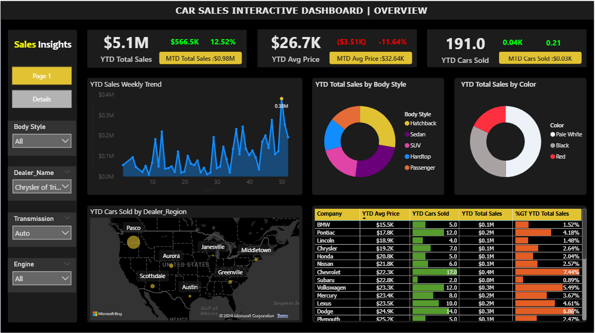

# Project Overview

This project is an interactive Car Sales Dashboard built using Power BI, designed to analyze and monitor Year-to-Date (YTD) and Month-to-Date (MTD) performance across multiple business dimensions.
The dashboard focuses on sales trends, pricing behavior, product mix, regional performance, and dealer-level insights, presented through a modern dark-themed UI for better readability and visual clarity.

# Dashboard Structure

This page provides a high-level snapshot of business performance:

## Key KPIs

YTD Total Sales

YTD Average Price

YTD Cars Sold

MTD comparison with growth/decline indicators

## Visual Insights

Weekly YTD Sales Trend

Sales Distribution by Body Style (Donut Chart)

Sales Distribution by Color (Donut Chart)

Cars Sold by Dealer Region (Map View)

# Details Page

This page is designed for deep-dive analysis and record-level exploration:

Transaction-level sales data

Customer and dealer information

Vehicle attributes (company, model, color)

Sales value with conditional formatting

Total summary at the bottom for quick validation

This page supports operational analysis and detailed decision-making.

# Interactive Features

Page Navigation using buttons

Dynamic slicers:

Body Style

Dealer Name

Transmission Type

Engine Type

Cross-filtering across visuals

Conditional formatting for better insights

Dark theme optimized for long viewing sessions

# Tools & Technologies

Power BI Desktop

DAX Measures for:

YTD & MTD calculations

Growth percentage analysis

Power BI Maps (Bing) for regional visualization

# Dashboard Preview

### Overview Page

### Details Page

